##############################################################################
Chapter 0 Getting Ready (Important)
##############################################################################

Before starting building the projects, you need to make some preparation first, which is so crucial that you must not skip.

Programming Software
***************************************

Arduino Software (IDE) is used to write and upload the code for Arduino Board.

First, install Arduino Software (IDE): visit https://www.arduino.cc, click "Download" to enter the download page.

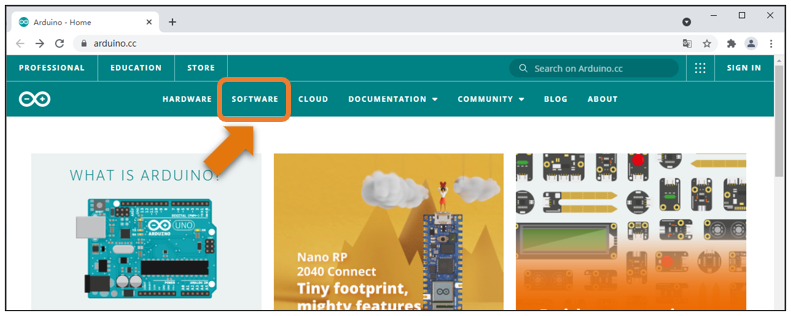

Select and download corresponding installer according to your operating system. If you are a windows user, please select the "Windows Installer" to download to install the driver correctly.

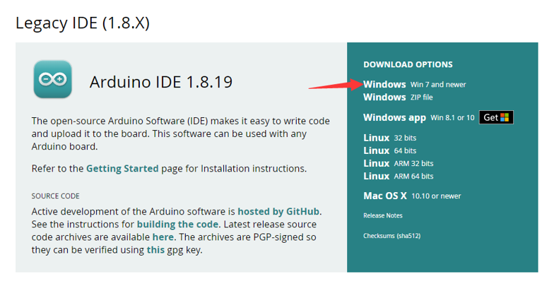

After the download completes, run the installer. For Windows users, there may pop up an installation dialog box of driver during the installation process. When it popes up, please allow the installation.

After installation is complete, an Arduino Software shortcut will be generated in the desktop. Run the Arduino Software.

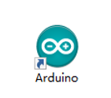

The interface of Arduino Software is as follows:

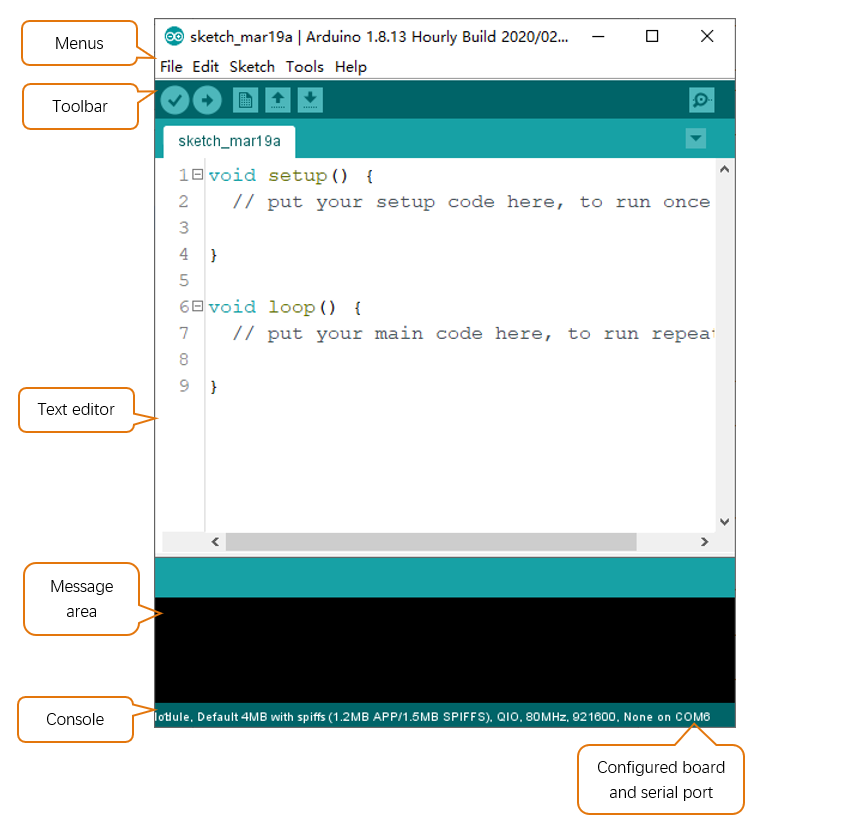

Programs written with Arduino Software (IDE) are called sketches. These sketches are written in the text editor and saved with the file extension.ino. The editor has features for cutting/pasting and searching/replacing text. The message area gives feedback while saving and exporting and also displays errors. The console displays text output by the Arduino Software (IDE), including complete error messages and other information. The bottom right-hand corner of the window displays the configured board and serial port. The toolbar buttons allow you to verify and upload programs, create, open, and save sketches, and open the serial monitor.

+----------------+--------------------------------------------------------------------------------+
| |Chapter00_04| | Verify                                                                         |
|                |                                                                                |
|                | Check your code for compile errors .                                           |
+----------------+--------------------------------------------------------------------------------+
| |Chapter00_05| | Upload                                                                         |
|                |                                                                                |
|                | Compile your code and upload them to the configured board.                     |
+----------------+--------------------------------------------------------------------------------+
| |Chapter00_06| | New                                                                            |
|                |                                                                                |
|                | Create a new sketch.                                                           |
+----------------+--------------------------------------------------------------------------------+
| |Chapter00_07| | Open                                                                           |
|                |                                                                                |
|                | Present a menu of all the sketches in your sketchbook.                         |
|                |                                                                                |
|                | Clicking one will open it within the current window and overwrite its content. |
+----------------+--------------------------------------------------------------------------------+
| |Chapter00_08| | Save                                                                           |
|                |                                                                                |
|                | Save your sketch.                                                              |
+----------------+--------------------------------------------------------------------------------+
| |Chapter00_09| | Serial Monitor                                                                 |
|                |                                                                                |
|                | Open the serial monitor.                                                       |
+----------------+--------------------------------------------------------------------------------+

Additional commands are found within the five menus: File, Edit, Sketch, Tools, Help. The menus are context sensitive, which means only those items relevant to the work currently being carried out are available.

Installation of Development Board Support Package
*************************************************************

1. Make sure your network is of good connection.

2. Open Arduino IDE, and click File -> Preference. In new pop-up window, find "Additional Boards Manager URLs", and replace with a new line：

https://github.com/earlephilhower/arduino-pico/releases/download/global/package_rp2040_index.json

As shown below:

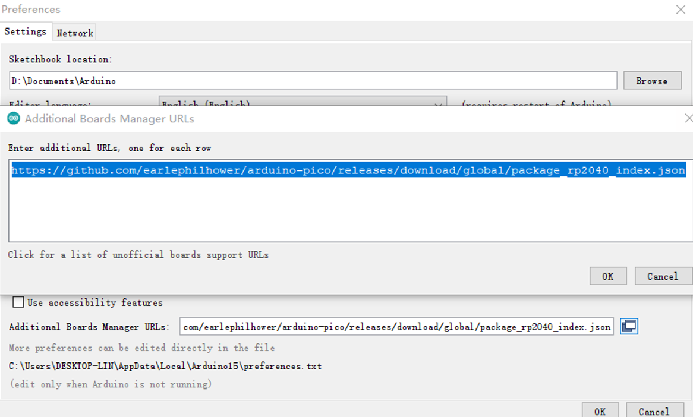

3. Open Arduino IDE. Click Tools -> Board -> Boards Manager...on the menu bar.

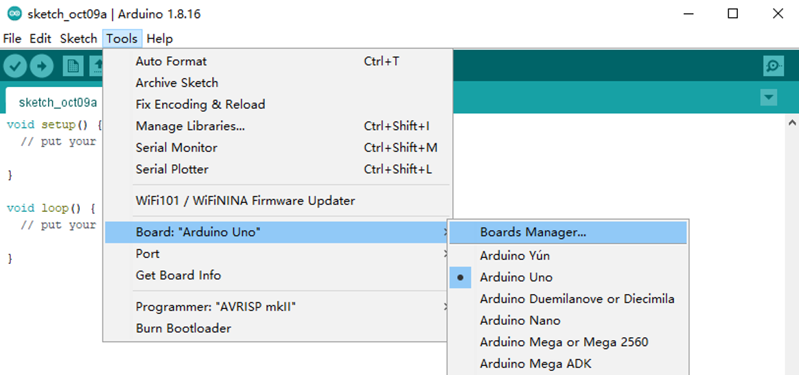

4. Enter Pico in the searching box, and select "Raspberry Pi Pico/RP2040" and click on Install.

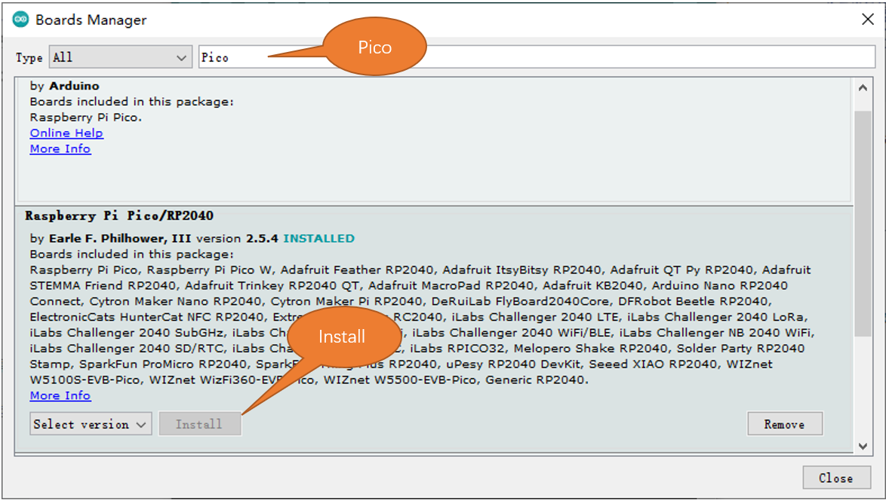

5. Click Yes in the pop-up "**dpinst-amd64.exe**" installation window. (Without it, you will fail to communicate with Arduino.) Thus far, we have finished installing the development support package.

Uploading Adruino-compatible Firmware for Pico 
****************************************************

If your Pico is new and you want to use Arduino to learn and develop, you need to upload an Adruino-compatible Firmware for it. Please refer to the following steps to cinfigure.

1. Disconnect Pico from computer. Keep pressing the white button (BOOTSEL) on Pico, and connect Pico to computer before releasing the button. (Note: Be sure to keep pressing the button before powering the Pico, otherwise the firmware will not download successfully)

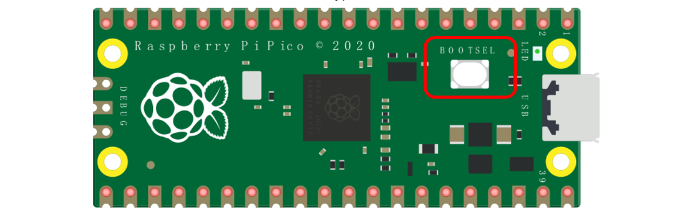

2. Open Arduino IDE. Click File -> Examples -> 01.Basics -> Blink.

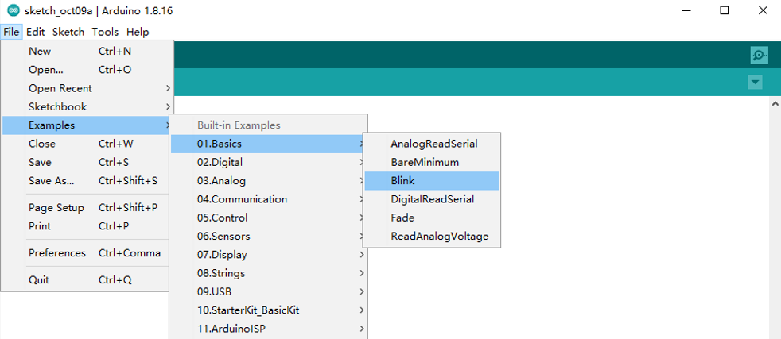

3. Click Tools -> Board -> Raspberry Pi RP2040 Boards -> Raspberry Pi Pico.

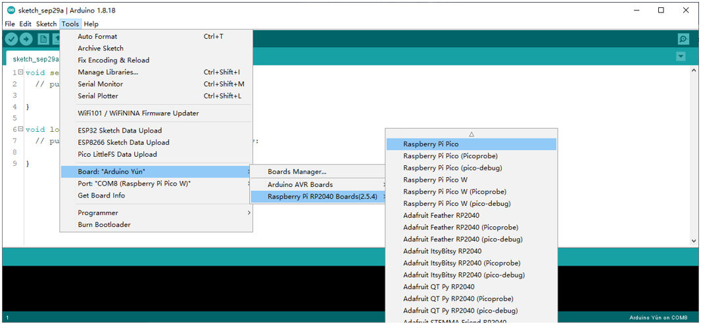

4. Upload sketch to Pico.

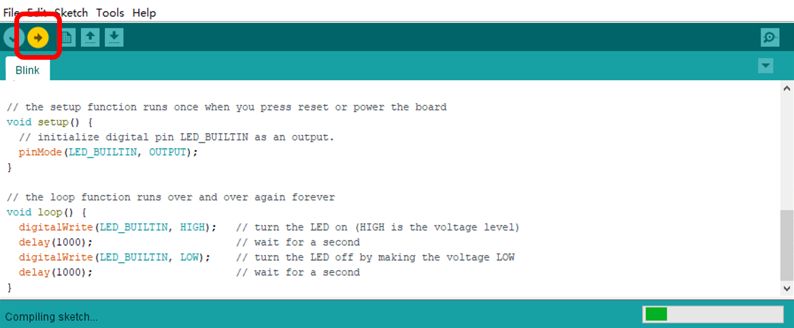

When the sketch finishes uploading, you can see the following prompt.

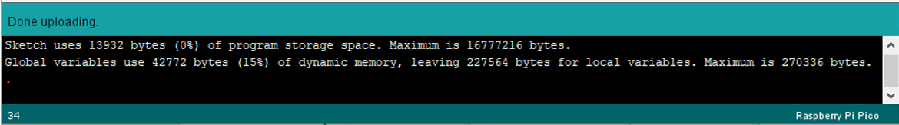

And the indicator on Pico starts to flash.

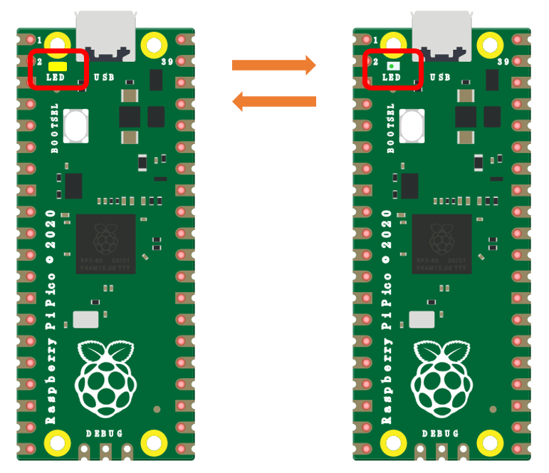

5. Click Tools -> Port -> COMx(Raspberry Pi Pico). X of COMx varies from different computers. Please select the correct one on your computer. In our case, it is COM9. 

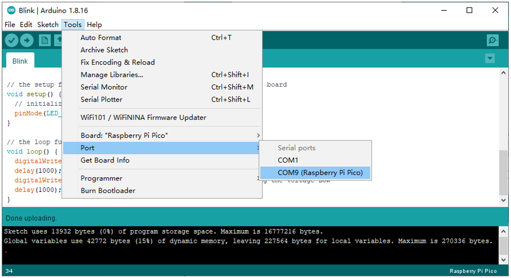

.. note::

    :red:`1. At the first time you use Arduino to upload sketch for Pico, you don't need to select port. After that, each time before uploading sketch, please check whether the port has beed selected; otherwise, the downloading may fail.`

    :red:`2. Sometimes when using, Pico may lose firmware due to the code and fail to work. At this point, you can upload firmware for Pico as mentioned above.`