##############################################################################
Chapter 1 LED (Important)
##############################################################################

.. note::
    
    :red:`Raspberry Pi Pico and Raspberry Pi Pico W only differ by wireless function, and are almost identical in other aspects. In this tutorial, except for the wireless function, other parts use Raspberry Pi Pico's map for tutorial demonstration.`

This chapter is the Start Point in the journey to build and explore Pico electronic projects. We will start with simple "Blink" project.

Project 1.1 Blink
****************************

In this project, we will use Raspberry Pi Pico to control blinking a common LED.

If you haven't installed Arduino IDE, you can click :ref:`Here <fnk0081/codes/c/0_getting_ready_(important):programming software>`.

If you haven't uploaded firmware for Pico, you can click :ref:`Here <fnk0081/codes/c/0_getting_ready_(important):uploading adruino-compatible firmware for pico>` to upload.

Component List
=============================

+--------------------------------+
| Raspberry Pi Pico(or Pico W)x1 |
|                                |
| |Chapter01_00|                 |
+--------------------------------+
| USB cable x1                   |
|                                |
| |Chapter01_01|                 |
+--------------------------------+

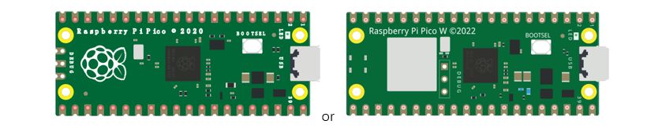

Power
----------------------------

Raspberry Pi Pico requires 5V power supply. You can either connect external 5V power supply to Vsys pin of Pico or connect a USB cable to the onboard USB base to power Pico.

In this tutorial, we use USB cable to power Pico and upload sketches.

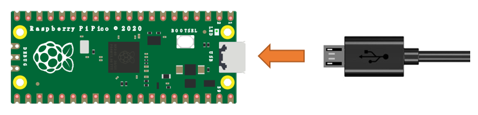

Sketch
=============================

The onboard LED of Raspberry Pi Pico is controlled by GP25. When GP25 outputs high level, LED lights up; When it outputs low, LED lights off. You can open the provided code:

C\\Sketches\\Sketch_01.1_Blink.

Before uploading code to Pico, please check the configuration of Arduino IDE.

Click Tools, make sure Board and Port are as follows:

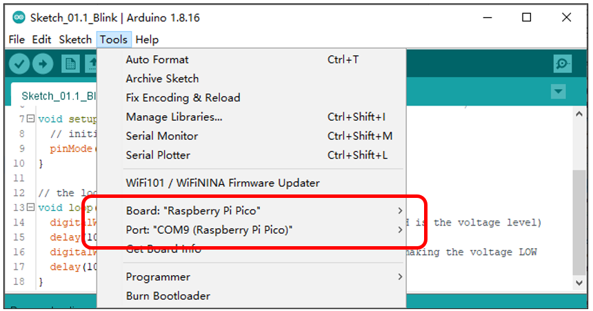

Click "Upload" to upload the sketch to Pico.

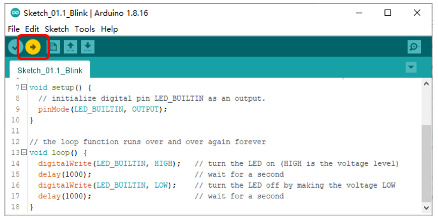

:red:`If you have any concerns, please contact us via:` support@freenove.com

Pico's on-board LED lights on and off every 1s, flashing cyclically. 

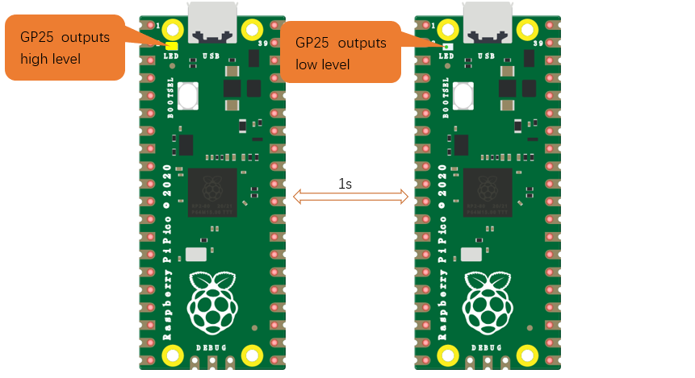

.. note::
    
    :red:`Pico's on-board LED is driven by GPIO25. Pico W's on-board LED uses WL_ GPIO0, which is defined as GPIO32 on Arduino.`

:red:`If you use Pico W, please change "# define LED_BUILTIN 25" to "# define LED_BUILTIN 32" in the code`

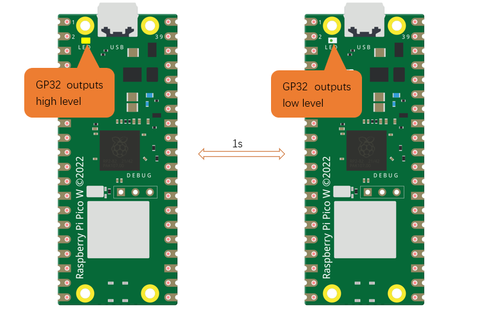

The following is the program code:

.. literalinclude:: ../../../Sketch_01.1_Blink/Sketch_01.1_Blink.ino
    :linenos:
    :language: c
    :dedent:

The Arduino IDE code usually contains two basic functions: void setup() and void loop(). 

After the board is reset, the setup() function will be executed firstly, and then the loop() function.

setup() function is generally used to write code to initialize the hardware. And loop() function is used to write code to achieve certain functions. loop() function is executed repeatedly. When the execution reaches the end of loop(), it will back to the beginning of loop() to run again.

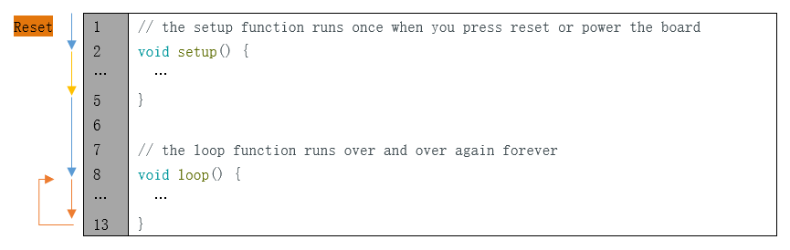

In the circuit, GP25 of Pico is connected to the LED, so the LED pin is defined as 25.

.. code-block:: c
    :linenos:

    #define LED_BUILTIN 25

This means that after this line of code, all LED_BUILTIN will be regarded as 25.

In the setup() function, first, we set the LED_BUILTIN as output mode, which can make the port output high or low level.

.. code-block:: c
    :linenos:

    // initialize digital pin LED_BUILTIN as an output.
    pinMode(LED_BUILTIN, OUTPUT);

Then, in the loop() function, set the LED_BUILTIN to output high level to make LED light up.

.. code-block:: c
    :linenos:

    digitalWrite(LED_BUILTIN, HIGH);  // turn the LED on (HIGH is the voltage level)

Wait for 1000ms, that is 1s. Delay() function is used to make control board wait for a moment before executing the next statement. The parameter indicates the number of milliseconds to wait for.

.. code-block:: c
    :linenos:

    delay(1000);                     // wait for a second

Then set the LED_BUILTIN to output low level, and LED lights off. One second later, the execution of loop() function will be completed. 

.. code-block:: c
    :linenos:

    digitalWrite(LED_BUILTIN, LOW);   // turn the LED off by making the voltage LOW
    delay(1000);                     // wait for a second

The loop() function is constantly being executed, so LED will keep blinking.

Reference
--------------------------

.. py:function:: void pinMode(int pin, int mode);	
    
    Configures the specified pin to behave either as an input or an output. 
    
    **Parameters**
    
    pin: the pin number to set the mode of LED.
    
    mode: INPUT, OUTPUT, INPUT_PULLDOWM, or INPUT_PULLUP.

.. py:function:: void digitalWrite (int pin, int value);	

    Writes the value HIGH or LOW (1 or 0) to the given pin which must have been previously set as an output.
    
For more related functions, please refer to https://www.arduino.cc/reference/en/

Project 1.2 Blink
*****************************

In this tutorial, we connect Raspberry Pi Pico and computer with a USB cable.

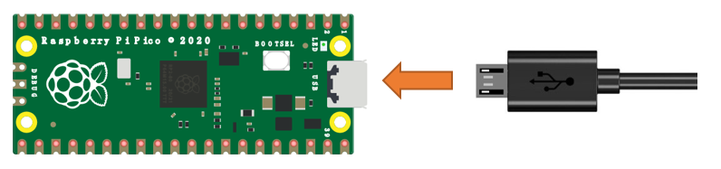

We will make GPIO15 blink.

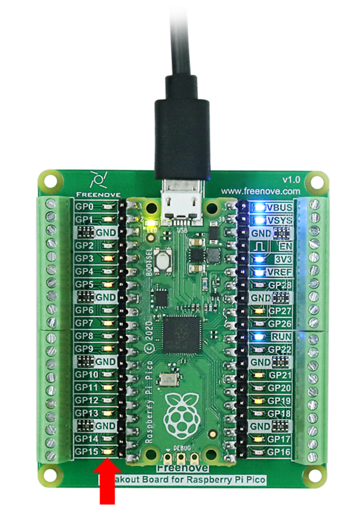

Sketch
==============================

According to the circuit diagram, when GP15 of Pico outputs high level, LED lights up; when it outputs low, LED lights off. Therefore, we can make LED flash repeatedly by controlling GP15 to output high and low repeatedly.

You can open the provided code:

C\\Sketches\\Sketch_01.2_Blink.

Before uploading code to Pico, please check the configuration of Arduino IDE. 

Click Tools, make sure Board and Port are as follows:

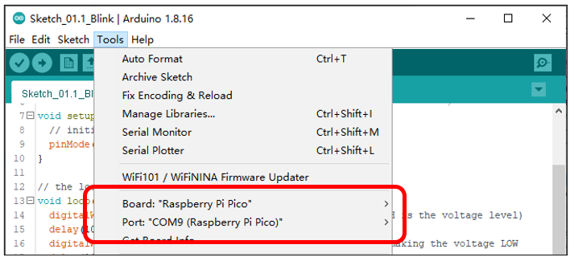

Click "Upload" to upload the sketch to Pico.

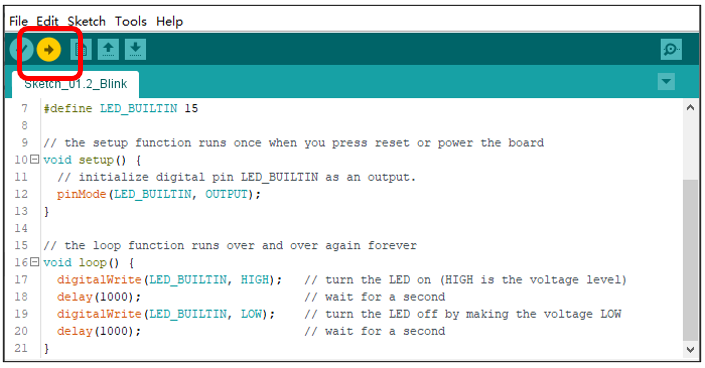

Click "Upload". Download the code to Pico and then LED for pin15 in starts Blink.

:red:`If you have any concerns, please contact us via:` support@freenove.com