##############################################################################
Chapter 1 LED (Important)
##############################################################################

Note: Raspberry Pi Pico and Raspberry Pi Pico W only differ by one wireless function, and are almost identical in other aspects. In this tutorial, except for the wireless function, other parts use Raspberry Pi Pico's map for tutorial demonstration.

This chapter is the Start Point in the journey to build and explore Raspberry Pi Pico electronic projects. We will start with simple "Blink" project.

Project 1.1 Blink
****************************************

In this project, we will use Raspberry Pi Pico to control blinking a common LED.

If you have not yet installed Thonny, click :ref:`here <fnk0081/codes/python/0_getting_ready_(important):0.1 installing thonny (important)>`.

If you have not yet downloaded Micropython Firmware, click :ref:`here <fnk0081/codes/python/0_getting_ready_(important):downloading micropython firmware>`.

If you have not yet loaded Micropython Firmware, click :ref:`here <fnk0081/codes/python/0_getting_ready_(important):burning a micropython firmware>`.

Component List
=========================================

+--------------------------------+
| Raspberry Pi Pico(or Pico W)x1 |
|                                |
| |Chapter01_00|                 |
+--------------------------------+
| USB cable x1                   |
|                                |
| |Chapter01_01|                 |
+--------------------------------+

.. |Chapter01_00| image:: ../_static/imgs/1_LED_(Important)/Chapter01_00.png
.. |Chapter01_01| image:: ../_static/imgs/1_LED_(Important)/Chapter01_01.png

Power
----------------------------

Raspberry Pi Pico requires 5V power supply. You can either connect external 5V power supply to Vsys pin of Pico or connect a USB cable to the onboard USB base to power Pico.

In this tutorial, we use USB cable to power Pico and upload sketches.

.. image:: ../_static/imgs/1_LED_(Important)/Chapter01_02.png
    :align: center

Code
==============================

Codes used in this tutorial are saved in "Freenove_Ultimate_Starter_Kit_for_Raspberry_Pi_Pico/Python_Codes". You can move the codes to any location. For example, we save the codes in Disk(D) with the path of "D:/Micropython_Codes".

01.1_Blink
--------------------------------

Open "Thonny", click "This computer" -> "D:" -> "Micropython_Codes".

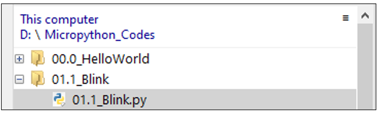

Expand folder "01.1_Blink" and double click "01.1_Blink.py" to open it. As shown in the illustration below.

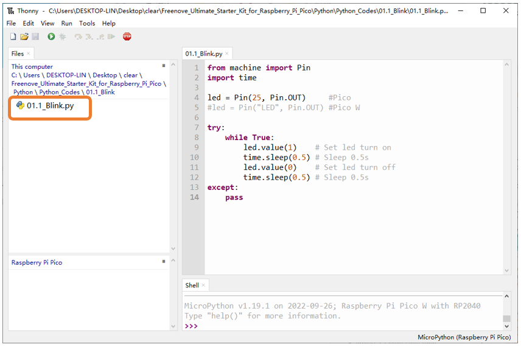

Make sure Raspberry Pi Pico has been connected with the computer. Click "Stop/Restart backend", and then wait to see what interface will show up.

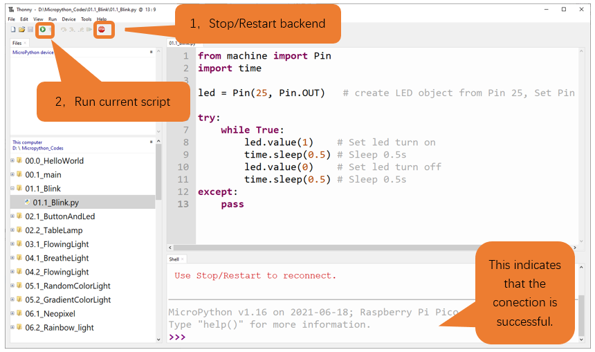

Click "Run current script" shown in the box above, the code starts to be executed and the LED in the circuit starts to blink. Press Ctrl+C or click "Stop/Restart backend" to exit the program.

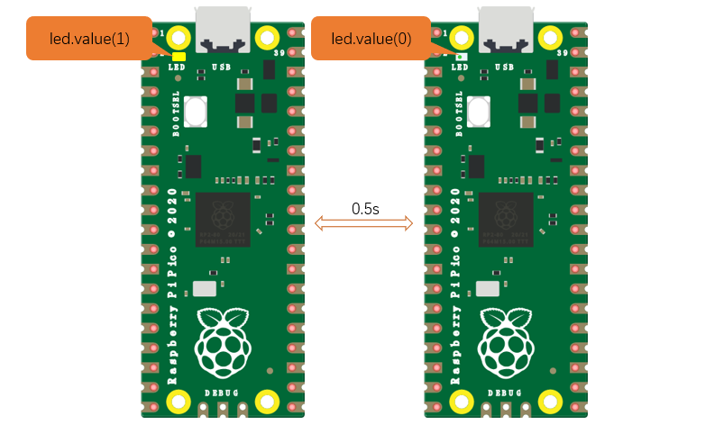

.. note::

    This is the code :ref:`running online <fnk0081/codes/python/0_getting_ready_(important):running online>`. If you disconnect USB cable and repower Raspberry Pi Pico, LED stops blinking and the following messages will display in Thonny.

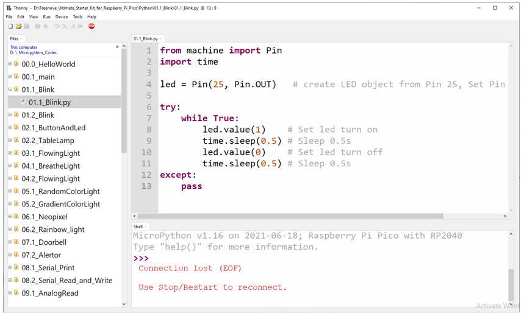

Uploading code to Raspberry Pi Pico
--------------------------------------

As shown in the following illustration, right-click the file 01.1_Blink.py and select "Upload to /" to upload code to Raspberry Pi Pico.

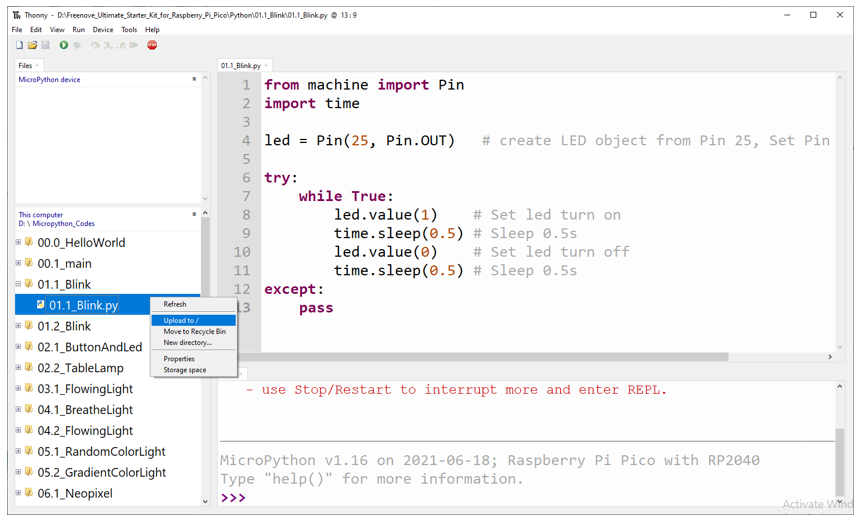

Upload main.py in the same way. 

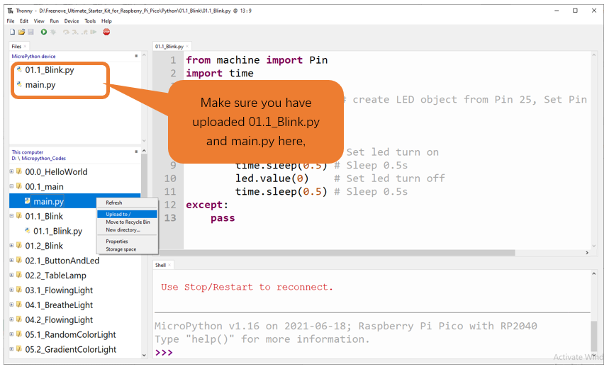

Disconnect Raspberry Pi Pico USB cable and reconnect it, LED on Pico will blink repeatedly. 

.. note::

    Codes here is run offline. If you want to stop running offline and enter Shell, just click "Stop" in Thonny.

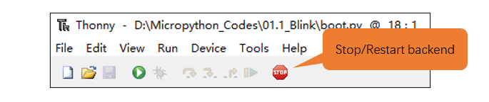

:red:`If you have any concerns, please contact us via:` support@freenove.com

The following is the program code:

.. literalinclude:: ../../../freenove_Kit/Python/Python_Codes/01.1_Blink/01.1_Blink.py
    :linenos:
    :language:  python
    :dedent:

Each time a new file is opened, the program will be executed from top to bottom. When encountering a loop construction, it will execute the loop statement according to the loop condition.

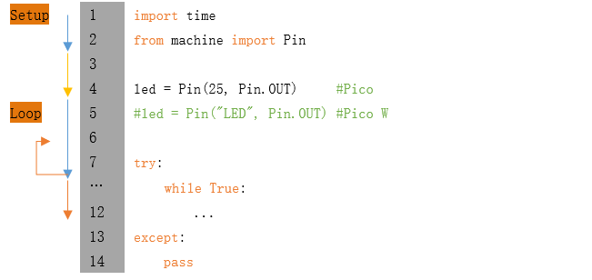

Print() function is used to print data to Terminal. It can be executed in Terminal directly or be written in a Python file and executed by running the file.

.. code-block:: python
    :linenos:

    print("Hello world!")

Each time when using the functions of Raspberry Pi Pico, you need to import modules corresponding to those functions: Import time module and Pin module of machine module.

.. code-block:: python
    :linenos:

    import time
    from machine import Pin

Configure GP25 of Raspberry Pi Pico to output mode and assign it to an object named "led". 

Configure "LED" of Raspberry Pi Pico W to output mode and assign it to an object named "led".

.. code-block:: python
    :linenos:

    led = Pin(25, Pin.OUT)     #Pico 
    #led = Pin("LED", Pin.OUT) #Pico W

It means that from now on, LED representing GP25 is in output mode.

Set the value of LED to 1 and GP25 will output high level.

.. code-block:: python
    :linenos:

    led.value(1) #Set led turn on

Set the value of LED to 0 and led pin will output low level.

.. code-block:: python
    :linenos:

    led.value(0) #Set led turn off

Execute codes in a while loop.

.. code-block:: python
    :linenos:

    while True:
        ...

Put statements that may cause an error in "try" block and the executing statements when an error occurs in "except" block. In general, when the program executes statements, it will execute those in "try" block. However, when an error occurs to Raspberry Pi Pico due to some interference or other reasons, it will execute statements in "except" block.

"Pass" is an empty statement. When it is executed, nothing happens. It is useful as a placeholder to make the structure of a program look better. 

.. code-block:: python
    :linenos:

    try:
        ...
    except:
        pass

The single-line comment of Micropython starts with a "#" and continues to the end of the line. Comments help us to understand code. When programs are running, Thonny will skip comments.

.. code-block:: python
    :linenos:

    #Set led turn on

MicroPython uses indentations to distinguish different blocks of code instead of braces. The number of indentations is changeable, but it must be consistent throughout one block. If the indentation of the same code block is inconsistent, it will cause errors when the program runs.

.. code-block:: python
    :linenos:

    while True:
        led.value(1)    #Set led turn on
        time.sleep(0.5) #Sleep 0.5s
        led.value(0)    #Set led turn off
        time.sleep(0.5) #Sleep 0.5s

The above code will print "Hello world!" when the condition is True.

How to import python files
----------------------------------

If you import the module directly you should indicate the module to which the function or attribute belongs when using the function or attribute (constant, variable) in the module. The format should be: <module name>.<function or attribute>, otherwise an error will occur. 

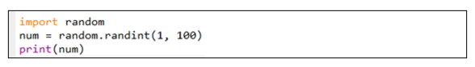

If you only want to import a certain function or attribute in the module, use the from...import statement. The format is as follows

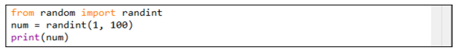

When using "from...import" statement to import function, to avoid conflicts and for easy understanding, you can use "as" statement to rename the imported function, as follows

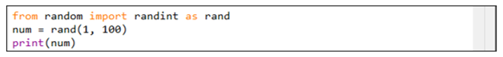

Reference
------------------------------------

.. py:function:: Class machine	

    Before each use of the **machine** module, please add the statement "**import machine**" to the top of python file.

    **machine.freq(freq_val):** When "freq_val" is not specified, it is to return to the current CPU frequency; Otherwise, it is to set the current CPU frequency.

    **freq_val:** 125000000Hz(125MHz).

    **machine.reset():** A reset function. When it is called, the program will be reset.

    **machine.unique_id():** Obtains MAC address of the device. 

    **machine.idle():** Turns off any temporarily unused functions on the chip and its clock, which is useful to reduce power consumption at any time during short or long periods.

    **machine.disable_irq():** Disables interrupt requests and return the previous IRQ state. The disable_irq () function and enable_irq () function need to be used together; Otherwise the machine will crash and restart.

    **machine.enable_irq(state):** To re-enable interrupt requests. The parameter state should be the value that was returned from the most recent call to the disable_irq() function.

    **machine.time_pulse_us(pin, pulse_level, timeout_us=1000000):** 

        Tests the duration of the external pulse level on the given pin and returns the duration of the external pulse level in microseconds. When pulse level = 1, it tests the high level duration; When pulse level = 0, it tests the low level duration.

        If the setting level is not consistent with the current pulse level, it will wait until they are consistent, and then start timing. If the set level is consistent with the current pulse level, it will start timing immediately.

        When the pin level is opposite to the set level, it will wait for timeout and return "-2". When the pin level and the set level is the same, it will also wait timeout but return "-1". **timeout_us** is the duration of timeout. 

        For more information about class and function, please refer to:

        https://docs.micropython.org/en/latest/rp2/quickref.html

.. py:function:: Class time	

    Before each use of the **time** module, please add the statement "**import time**" to the top of python file

    **time.sleep(sec):** Sleeps for the given number of seconds.

        **sec:** This argument should be either an int or a float.

    **time.sleep_ms(ms):** Sleeps for the given number of milliseconds, ms should be an int.

    **time.sleep_us(us):** Sleeps for the given number of microseconds, us should be an int.

    **time.time():** Obtains the timestamp of CPU, with second as its unit.

    **time.ticks_ms():** Returns the incrementing millisecond counter value, which recounts after some values.

    **time.ticks_us():** Returns microsecond.

    **time.ticks_cpu():** Similar to ticks_ms() and ticks_us(), but it is more accurate(return clock of CPU).

    **time.ticks_add(ticks, delta):** Gets the timestamp after the offset.

        **ticks:** ticks_ms()、ticks_us()、ticks_cpu().

        **delta:** Delta can be an arbitrary integer number or numeric expression.

    **time.ticks_diff(old_t, new_t):** Calculates the interval between two timestamps, such as ticks_ms(), ticks_us() or ticks_cpu().

        **old_t:** Starting time.

        **new_t:** Ending time.

.. py:function:: Class Pin(id, mode, pull, value)
    
    Before each use of the Pin module, please add the statement "from machine import Pin" to the top of python file.
    
    **id:** Arbitrary pin number.
    
    **mode:** Mode of pins.
    
        **Pin.IN:** Input Mode.
    
        **Pin.OUT:** Output Mode.
    
        **Pin.OPEN_DRAIN:** Open-drain Mode.
    
    **Pull:** Whether to enable the internal pull up and down mode.
    
        **None:** No pull up or pull down resistors.
    
        **Pin.PULL_UP:** Pull-up Mode, outputting high level by default.
    
        **Pin.PULL_DOWN:** Pull-down Mode, outputting low level by default.
    
    **Value:** State of the pin level, 0/1.
    
    **Pin.init(mode, pull):** Initialize pins. 
    
    **Pin.value([value]):** Obtain or set state of the pin level, return 0 or 1 according to the logic level of pins. Without parameter, it reads input level. With parameter given, it is to set output level. 
    
        **value:** It can be either True/False or 1/0.
    
    **Pin.irq(trigger, handler):** Configures an interrupt handler to be called when the pin level meets a condition.
    
        **trigger:**
    
            **Pin.IRQ_FALLING:** interrupt on falling edge.
    
            **Pin.IRQ_RISING:** interrupt on rising edge.
    
        **Handler:** callback function.

Project 1.2 Blink
*****************************************

In this project, we will make LED for GPIO15 blink.

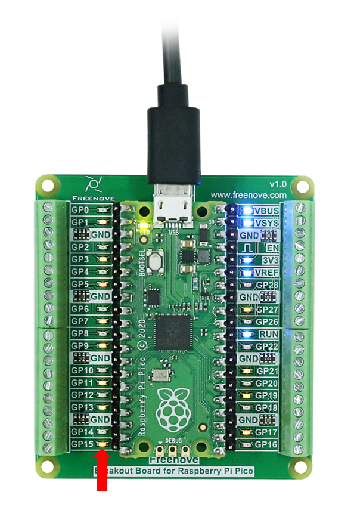

Code
========================================

Codes used in this tutorial are saved in "Freenove_Ultimate_Starter_Kit_for_Raspberry_Pi_Pico/Python_Codes". You can move the codes to any location. For example, we save the codes in Disk(D) with the path of "D:/Micropython_Codes".

01.2_Blink
---------------------------------------

Open "Thonny", click "This computer" -> "D:" -> "Micropython_Codes".

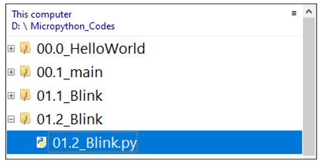

Expand folder "01.2_Blink" and double click "01.2_Blink.py" to open it. As shown in the illustration below.

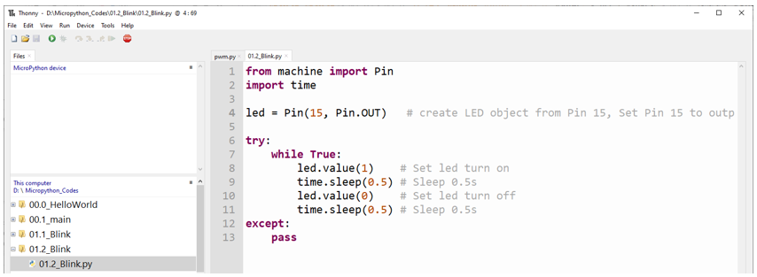

Make sure Raspberry Pi Pico has been connected with the computer. Click "Stop/Restart backend", and then wait to see what interface will show up.

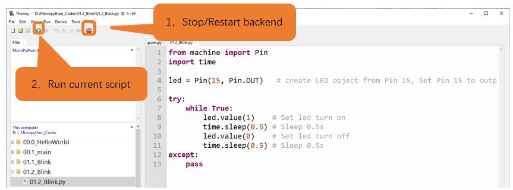

Click "Run current script" shown in the box above, the code starts to be executed and then the LED for GPIO15 starts to blink. Press Ctrl+C or click "Stop/Restart backend" to exit the program.

.. note::

    This is the code :ref:`running online <fnk0081/codes/python/0_getting_ready_(important):running online>`. If you disconnect USB cable and repower Raspberry Pi Pico, LED stops blinking and the following messages will be displayed in Thonny.

Uploading code to Raspberry Pi Pico
-----------------------------------------

As shown in the following illustration, right-click the file 01.2_Blink.py and select "Upload to /" to upload code to Raspberry Pi Pico.

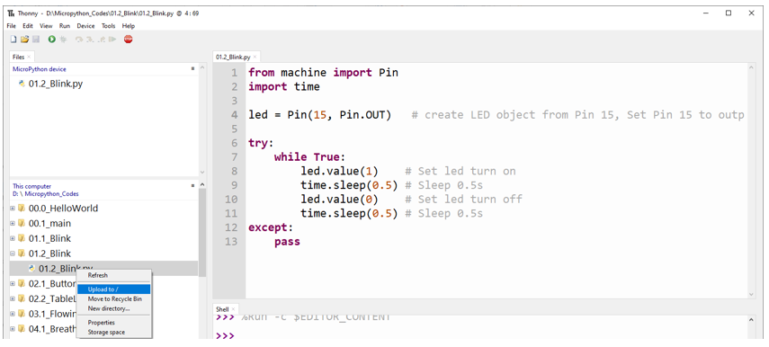

Upload main.py in the same way.

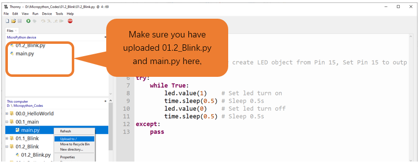

Disconnect Raspberry Pi Pico USB cable and reconnect it, LED on Pico will blink repeatedly. 

.. note::

    Codes here is run offline. If you want to stop running offline and enter Shell, just click "Stop" in Thonny.

:red:`If you have any concerns, please contact us via:` support@freenove.com